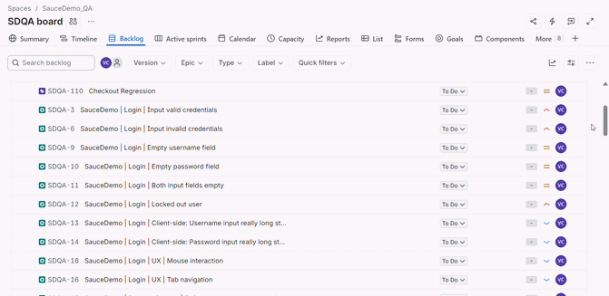
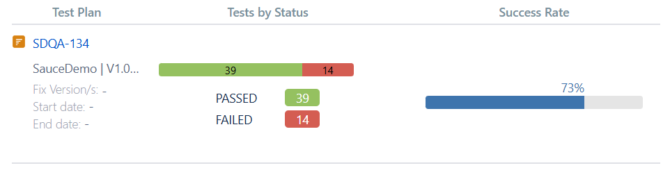

# :floppy_disk: SauceDemo Manual Testing

This repository contains a manual testing project for the [SauceDemo](https://www.saucedemo.com/) e-commerce application.

The testing initially was managed in **Jira** with **Xray Test Management**; however, to ensure the work can be permanently accessed outside of a private Jira setup, the main materials have been converted into Markdown format.

The test suite combines **positive** and **negative** test cases, with additional coverage for **boundary** conditions and input validation. **Exploratory testing** was also used to identify usability and accessibility issues such as missing keyboard and mouse focus indicators.

## Execution Summary

The full regression cycle included all **53 test cases**. The smoke cycle covered a critical subset of 9 tests.

| Metric | Smoke | Regression | 
|--------|-------|------------|
| Total | 9 | 53 |
| Passed | 9 | 39 |
| Failed | 0 | 14 |
| Bugs Reported | 0 | 14 |

Xray test plan overview including both test executions:

**Reports:**
- **[Smoke Execution](test-executions/smoke-test-execution.md)**
- **[Regression Execution](test-executions/regression-test-execution.md)**

## Conclusions & Key Defects Found
Defects were clustered primarily in **Checkout** (9) and **Login** (4) features, with only 1 defect in **Product Catalog**. Most of the issues relate to missing input validation, both client-side and server-side, which could introduce data integrity or security vulnerabilities in a real production environment.

Additionally, the website lacks clear focus indicators for both keyboard and mouse interactions (e.g., hover and click). The missing keyboard focus indicators in this case could suggest a potential violation of [**WCAG 2.4.7 Focus Visible**](https://www.w3.org/WAI/WCAG22/Understanding/focus-visible.html) standard, which could worsen the experience of keyboard-only users.

**Example defects:**
- **[SDQA-124](bugs/bug-reports/SDQA-124-empty-cart-checkout.md)**: User can access checkout form with no items in the cart, which allows placing orders with no items.
- **[SDQA-123](bugs/bug-reports/SDQA-123-sort-reset.md)**: When user sorts products by price and refreshes the page, selected sort option resets to the default option.
- **[SDQA-118](bugs/bug-reports/SDQA-118-login-ux-keyboard.md)**: Login page lacks visible focus indicators for keyboard navigation.

Full list of bugs: **[Bug Report Overview](bugs/bugs-overview.md)**

## Repository Structure

- **`user-stories/`**: Requirements as user stories with acceptance criteria written in Gherkin format.
- **`preconditions/`**: Reusable setup states.
- **`test-cases/`**: Detailed test cases grouped by feature and an overview.
    - [`tests-overview.md`](test-cases/tests-overview.md) - Full list of test cases by feature.
- **`test-sets/`**: Smoke and regression test sets with ranked test cases.
- **`test-executions/`**: Execution reports with pass/fail results and linked bugs.
- **`bugs/`**: Detailed bug reports with evidence and an overview.
    - [`bugs-overview.md`](bugs/bugs-overview.md) - Full list of bugs by feature.
- **`evidence/`**: Screenshots, GIFs, and Jira/Xray visuals used across the repo.