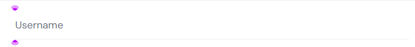
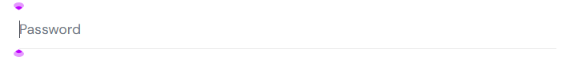

# SDQA-118: SauceDemo | Login | UX |  Input fields and button lack visible focus indicators for keyboard navigation

| Attribute          | Value |
|--------------------|-------|
| **Bug ID**         | SDQA-118 |
| **Priority**       | Low |
| **Severity**        | Low |
| **Build Version**        | V1.0 |
| **Environment**        | PROD |
| **Linked Test Case** | [SDQA-16](../../test-cases/login/SDQA-16-tab-navigation.md) – SauceDemo \| Login \| UX \| Tab navigation |

## Preconditions:
- [SDQA-4](../../preconditions/SDQA-4-on-login-page.md): User is located on the [login page]( https://www.saucedemo.com/).

## Steps & Results:

| Action | Expected Result | Actual Result |
|--------|-----------------|---------------|
| User presses the "Tab" key once. | The cursor/focus moves to the "Username" field. A visual highlight border appears. | The cursor appears in the “Username” input field, **but there is no visual highlight:**  |
| User presses the Tab key again (2nd time). | The cursor/focus moves to the "Password" field. A visual highlight border appears. | The cursor moves to the “Password” input field, **but there is no visual highlight:**  |
| User presses the Tab key again (3rd time). | The cursor/focus moves to the "Login" button. The button is visually highlighted. | **The button does not visually highlight for the user:**  |

## Device Under Test (DUT):
- **DEVICE:** HP Victus 15 
- **OS:** Windows 11 Home, 25H2
- **BROWSER:** Google Chrome Version 150.0.7871.46

## Reproducibility & Account:
**Reproducibility:** 5/5 (consistently reproducible)
**Account used for testing:**  N/A