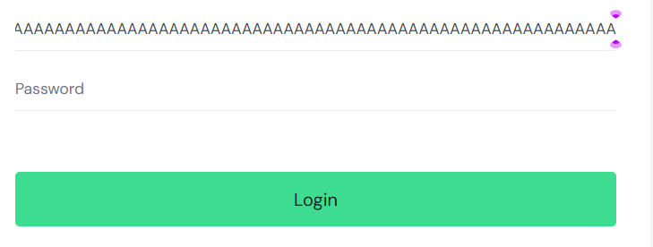

# SDQA-121: SauceDemo | Login | UX | Login username field accepts infinite number of characters

| Attribute          | Value |
|--------------------|-------|
| **Bug ID**         | SDQA-121 |
| **Priority**       | Low |
| **Severity**       | Low |
| **Build Version**  | V1.0 |
| **Environment**    | PROD |
| **Linked Test Case** | [SDQA-13](../../test-cases/login/SDQA-13-long-username.md) – SauceDemo \| Login \| Client-side: Username input really long string |

## Preconditions:
- [SDQA-4](../../preconditions/SDQA-4-on-login-page.md): User is located on the [login page]( https://www.saucedemo.com/).

## Steps & Results:

| Action | Expected Result | Actual Result |
|--------|-----------------|---------------|
| User inputs a very long string of characters (e.g., 'a' 200+ times) into username field. | The input field prevents the user from typing more than defined limit of characters (e.g., 50). | The " Username" input field accepts infinite amount of characters:  |

## Device Under Test (DUT):
- **DEVICE:** HP Victus 15 
- **OS:** Windows 11 Home, 25H2
- **BROWSER:** Google Chrome Version 150.0.7871.46

## Reproducibility & Account:
**Reproducibility:** 5/5 (consistently reproducible)
**Account used for testing:**  N/A