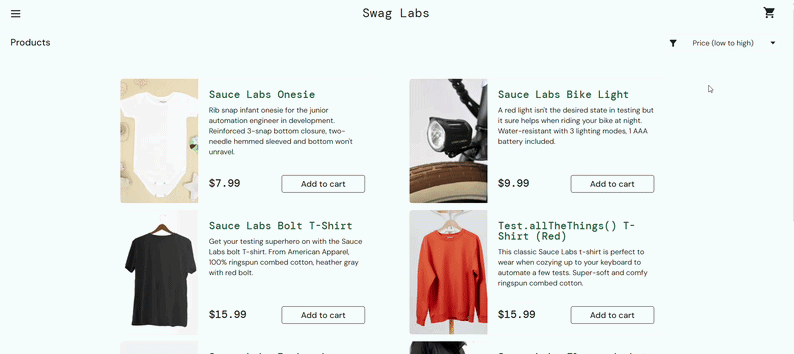

# SDQA-123: SauceDemo | Product Catalog | Applied sorting option resets to default after page refresh

| Attribute          | Value |
|--------------------|-------|
| **Bug ID**         | SDQA-123 |
| **Priority**       | Low |
| **Severity**       | Low |
| **Build Version**  | V1.0 |
| **Environment**    | PROD |
| **Linked Test Case** | [SDQA-27](../../test-cases/product-catalog/SDQA-27-refresh-sort.md) – Product Catalog \| Refresh page preserves applied sort |

## Preconditions:
- [SDQA-32](../../preconditions/SDQA-32-logged-in.md): User is logged in as standard_user.
- [SDQA-31](../../preconditions/SDQA-31-catalog-page.md): User is located on the product catalog page.
- [SDQA-33](../../preconditions/SDQA-33-products-sorted.md): User has sorted products by price (low to high).

## Steps & Results:

| Action | Expected Result | Actual Result |
|--------|-----------------|---------------|
| User notes the sort option in the top right corner. | The sorting option in the top right corner under cart icon is set "Price (low to high)"; products are sorted in ascending order by price. | - |
| User refreshes the page. | The products remain sorted by price (low to high) and the dropdown still shows the previously selected option "Price (low to high)". | **The sorting option resets to the default option: Name (A to Z).** See video in the Attachments. |

## Device Under Test (DUT):
- **DEVICE:** HP Victus 15 
- **OS:** Windows 11 Home, 25H2
- **BROWSER:** Google Chrome Version 150.0.7871.46

## Reproducibility & Account:
- **Reproducibility:** 5/5 (consistently reproducible)
- **Account used for testing:**  standard_user (password: secret_sauce)

## Attachments:
