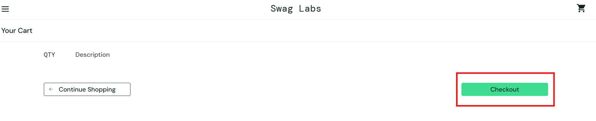
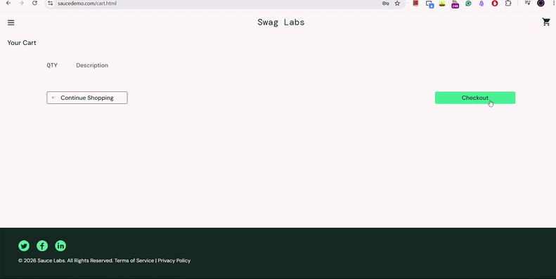

# SDQA-124: SauceDemo | Checkout | User can access checkout with an empty cart

| Attribute          | Value |
|--------------------|-------|
| **Bug ID**         | SDQA-124 |
| **Priority**       | Medium |
| **Severity**       | Medium |
| **Build Version**  | V1.0 |
| **Environment**    | PROD |
| **Linked Test Case** | [SDQA-72](../../test-cases/checkout/SDQA-72-checkout-not-accessible.md) – SauceDemo \| Checkout \| Checkout button is disabled when cart is empty |

## Preconditions:
- [SDQA-32](../../preconditions/SDQA-32-logged-in.md): User is logged in as standard_user.
- [SDQA-67](../../preconditions/SDQA-67-on-cart-page.md): User is located on the cart page.
- [SDQA-73](../../preconditions/SDQA-73-no-items-in-cart.md): User has no items in the cart.

## Steps & Results:

| Action | Expected Result | Actual Result |
|--------|-----------------|---------------|
| User locates "Checkout" button in the bottom right corner and attempts to click it. |The "Checkout" button is grayed out/disabled and cannot be clicked; the user is NOT redirected to the "Checkout: Your Information" page (`/checkout-step-one.html`). | The button is **not disabled**:  When button is clicked, User is redirected to the "Checkout: Your Information" page (`/checkout-step-one.html`) (see video in Attachments). |

## Device Under Test (DUT):
- **DEVICE:** HP Victus 15 
- **OS:** Windows 11 Home, 25H2
- **BROWSER:** Google Chrome Version 150.0.7871.46

## Reproducibility & Account:
**Reproducibility:** 5/5 (consistently reproducible)
**Account used for testing:**  standard_user (password: secret_sauce)

## Attachments:
