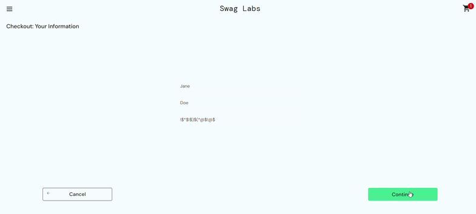

# SDQA-130: SauceDemo | Checkout | UX |  Checkout "Zip/Postal Code" field accepts special characters

| Attribute          | Value |
|--------------------|-------|
| **Bug ID**         | SDQA-130 |
| **Priority**       | Low |
| **Severity**       | Low |
| **Build Version**  | V1.0 |
| **Environment**    | PROD |
| **Linked Test Case** | [SDQA-94](../../test-cases/checkout/SDQA-94-zipcode-spec-char.md) – Checkout \| Server-side: Zip Code input does not accept special characters |

## Preconditions:
- [SDQA-32](../../preconditions/SDQA-32-logged-in.md): User is logged in as standard_user.
- [SDQA-42](../../preconditions/SDQA-42-has-items.md): User has item(s) in the cart.
- [SDQA-75](../../preconditions/SDQA-75-on-checkout-information.md): User is on the checkout information page.

## Steps & Results:

| Action | Expected Result | Actual Result |
|--------|-----------------|---------------|
| User enters a valid First Name (e.g., Jane) into the "First Name" input field. | The "First Name" input field displays the entered name (e.g., Jane). | - |
| User enters a valid Last Name (e.g., Doe) into the "Last Name" input field. | The "Last Name" input field displays the entered name (e.g., Doe). | - |
| User inputs a string of special characters (e.g., "@&$^@%") into the "Zip/Postal Code" input field. | The "Zip/Postal Code" input field displays entered string (e.g., "@&$^@%"). | - |
| User clicks the "Continue" button in the bottom right corner. | The server rejects the request and displays an error message: "Zip code must contain only letters and numbers." and the input field is highlighted in red color. | The "Zip/Postal Code" input of special characters is accepted and the user is redirected to the "Checkout: Overview" page; no error message displayed (see video in Attachments). |

## Device Under Test (DUT):
- **DEVICE:** HP Victus 15 
- **OS:** Windows 11 Home, 25H2
- **BROWSER:** Google Chrome Version 150.0.7871.46

## Reproducibility & Account:
- **Reproducibility:** 5/5 (consistently reproducible)
- **Account used for testing:**  standard_user (password: secret_sauce)

## Attachments:
