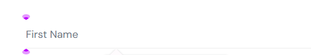
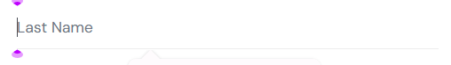
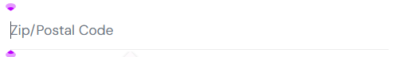
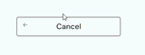
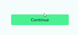

# SDQA-131: SauceDemo | Checkout | UX |  Input fields and button lack visible focus indicators for mouse navigation

| Attribute          | Value |
|--------------------|-------|
| **Bug ID**         | SDQA-131 |
| **Priority**       | Low |
| **Severity**       | Low |
| **Build Version**  | V1.0 |
| **Environment**    | PROD |
| **Linked Test Case** | [SDQA-112](../../test-cases/checkout/SDQA-112-checkout-mouse-interactions.md) – Checkout \| UX \| Mouse interactions on Information Page |

## Preconditions:
- [SDQA-32](../../preconditions/SDQA-32-logged-in.md): User is logged in as standard_user.
- [SDQA-42](../../preconditions/SDQA-42-has-items.md): User has item(s) in the cart.
- [SDQA-75](../../preconditions/SDQA-75-on-checkout-information.md): User is on the checkout information page.

## Steps & Results:

| Action | Expected Result | Actual Result |
|--------|-----------------|---------------|
| User clicks on the "First Name" input field. | The "First Name" input field is selected and has a visible visual highlight. | The cursor appears in the "First Name" input field, **but there is no visual highlight:** |
| User clicks on the "Last Name" input field. | The "Last Name" input field is selected and has a visible visual highlight. | The cursor appears in the "Last Name" input field, **but there is no visual highlight:**  |
| User clicks on the "Zip/Postal Code" input field. | The "Zip/Postal Code" input field is selected and has a visible visual highlight. | The cursor appears in the "Zip/Postal Code" input field, **but there is no visual highlight:**  |
| User hovers using mouse over the "<- Cancel" button. | The button changes its appearance by a distinct color; the cursor visibly changes to hand to indicate possible action. | The "<- Cancel" button does not visually highlight for the user, when hovered over:  |
| User hovers using mouse over the "Continue" button. | The button changes its appearance by a distinct color; the cursor visibly changes to hand to indicate possible action. | The "Continue" button does not visually highlight for the user, when hovered over:  |

## Device Under Test (DUT):
- **DEVICE:** HP Victus 15 
- **OS:** Windows 11 Home, 25H2
- **BROWSER:** Google Chrome Version 150.0.7871.46

## Reproducibility & Account:
- **Reproducibility:** 5/5 (consistently reproducible)
- **Account used for testing:**  standard_user (password: secret_sauce)