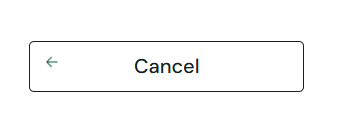
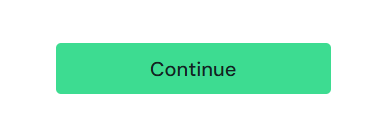

# SDQA-131: SauceDemo | Checkout | UX |  Input fields and button lack visible focus indicators for keyboard navigation

| Attribute          | Value |
|--------------------|-------|
| **Bug ID**         | SDQA-131 |
| **Priority**       | Low |
| **Severity**       | Low |
| **Build Version**  | V1.0 |
| **Environment**    | PROD |
| **Linked Test Case** | [SDQA-113](../../test-cases/checkout/SDQA-113-checkout-tab-navigation.md) – Checkout \| UX \| Tab navigation on Information Page |

## Preconditions:
- [SDQA-32](../../preconditions/SDQA-32-logged-in.md): User is logged in as standard_user.
- [SDQA-42](../../preconditions/SDQA-42-has-items.md): User has item(s) in the cart.
- [SDQA-75](../../preconditions/SDQA-75-on-checkout-information.md): User is on the checkout information page.

## Steps & Results:

| Action | Expected Result | Actual Result |
|--------|-----------------|---------------|
| User presses the "Tab" key twice. | The cursor/focus moves to the "First Name" field. A visual highlight border appears. | The cursor appears in the "First Name" input field, **but there is no visual highlight:** |
| User presses the Tab key again (3rd time). | The cursor/focus moves to the "Last Name" field. A visual highlight border appears. | The cursor moves to the "Last Name" input field, **but there is no visual highlight:**  |
| User presses the Tab key again (4th time). | The cursor/focus moves to the "Zip/Postal Code" field. A visual highlight border appears. | The cursor  moves to the "Zip/Postal Code" input field, **but there is no visual highlight:**  |
| User presses the Tab key again (5th time). | Focus moves to the "<- Cancel" button. The button is visually highlighted. | The "<- Cancel" button **does not visually highlight for the user:**  |
| User presses the Tab key again (6th time). | Focus moves to the "Continue" button. The button is visually highlighted. | The "Continue" button **does not visually highlight for the user:**  |

## Device Under Test (DUT):
- **DEVICE:** HP Victus 15 
- **OS:** Windows 11 Home, 25H2
- **BROWSER:** Google Chrome Version 150.0.7871.46

## Reproducibility & Account:
- **Reproducibility:** 5/5 (consistently reproducible)
- **Account used for testing:**  standard_user (password: secret_sauce)