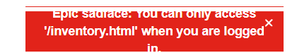

# SDQA-133: SauceDemo | Login | UI | Error message text overflows its container and is not fully readable

| Attribute          | Value |
|--------------------|-------|
| **Bug ID**         | SDQA-133 |
| **Priority**       | Low |
| **Severity**       | Low |
| **Build Version**  | V1.0 |
| **Environment**    | PROD |
| **Linked Test Case** | [SDQA-53](../../test-cases/logout/SDQA-53-protected-pages.md) – Logout \| Protected pages are inaccessible |

## Preconditions:
- [SDQA-54](../../preconditions/SDQA-54-logged-out.md): User has successfully logged out.

## Steps & Results:
| Action | Expected Result | Actual Result |
|--------|-----------------|---------------|
| User enters protected pages URL in the browser address bar (e.g., https://www.saucedemo.com/inventory.html). | User is not redirected to entered URL (e.g., product catalog page). The error message "You can only access 'XXX' when you are logged in." is displayed; **the error message is displayed inside its container with all text fully visible, without overflow or clipping.** | The user is not redirected, the error message is displayed, but the text overflows/clips outside its container and is not fully/easily readable:  |

## Device Under Test (DUT):
- **DEVICE:** HP Victus 15 
- **OS:** Windows 11 Home, 25H2
- **BROWSER:** Google Chrome Version 150.0.7871.46

## Reproducibility & Account:
- **Reproducibility:** 5/5 (consistently reproducible)
- **Account used for testing:** N/A